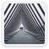
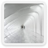

# 디자인 → 개발 핸드오프 실습

디자인 및 개발 과정을 진행합니다.

Figma 디자인을 열어 Auto Layout을 사용해 디자인을 구현합니다.

구현한 UI 디자인을 개발 코드로 핸드오프합니다.


## 수행 조건

테스트는 다음 조건을 충족해야 합니다.

- 모두가 접근 가능
- 의미있는 구조 설계
- 체계적인 표현 설계
- 원할한 상호작용 설계

## 구현 결과


## 마크업
```html
<ul class="list">
  <li class="list-item" tabindex="0">
    
    <p>History of Architecture</p>
  </li>

  <li class="list-item" tabindex="0">
    
    <p>Building design</p>
  </li>

  <li class="list-item" tabindex="0">
    
    <p>Graphics</p>
  </li>
  
  <li class="list-item" tabindex="0">
    
    <p>Climatology</p>
  </li>
</ul>
```

- 순서가 중요하지 않은 목록 `ul`과 list item을 뜻하는 `li`를 사용하여 마크업
- Tab 키로 이동 가능할 수 있도록 `tabindex="0"` 속성 추가
- 이미지 대체 텍스트 설정

## 스타일링

- flex를 사용하여 유연하게 배치
